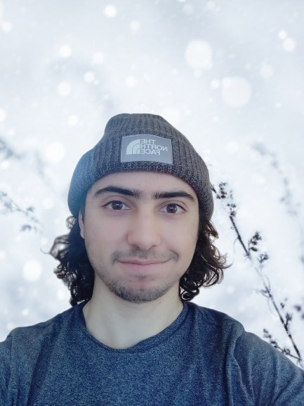

Hi there, I'm Hicham Janati. I'm a 3rd year PhD student at Inria in the [Parietal](https://team.inria.fr/parietal/) team, working under supervision of [Alexandre Gramfort](http://alexandre.gramfort.net) and [Marco Cuturi](http://marcocuturi.net). My current work involves designing machine learning models with an Optimal transport flavor for neuroscience.

### News
